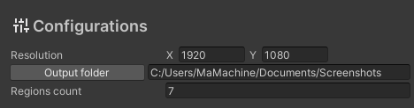
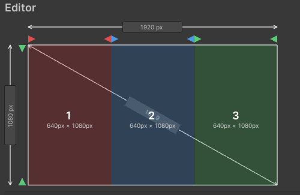
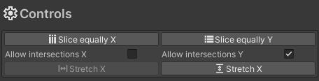
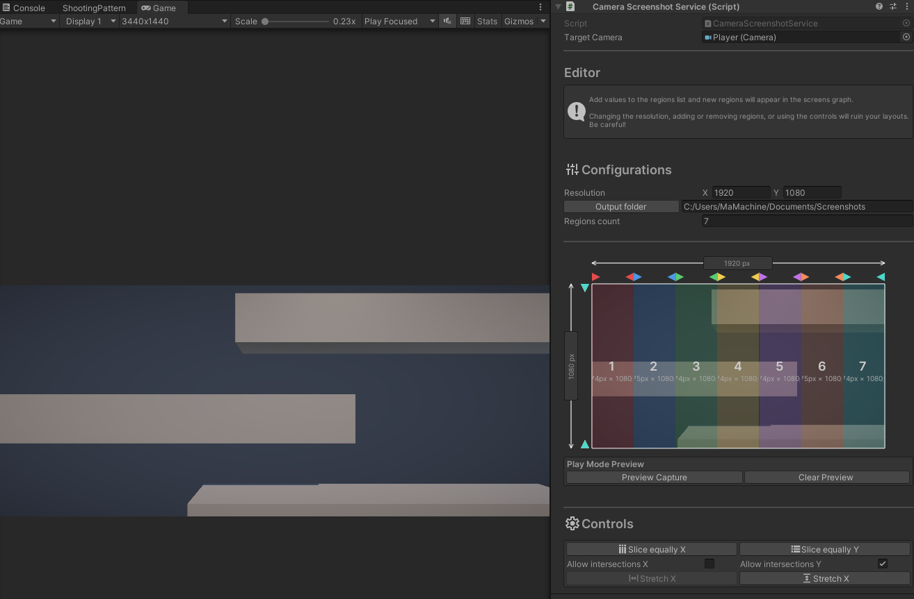

# Screenshot Regions Tool
A lightweight Unity editor tool for capturing multiple screenshot regions from a single camera.

Designed for workflows where you need consistent, repeatable screenshot crops.

## Setup
1. Add the CameraScreenshotService component to a GameObject or drop the prefab into the scene.
2. Assign a Camera to Target Camera.
3. Set the desired Capture Resolution (the target resolution for the screen).
4. Add entries to the Regions list.

## Editor Usage
* Set the configurations.<br>
<br><br>
* Regions are visualized in the inspector as colored rectangles.
* Drag the edge handles to resize regions.<br>
<br><br>
* Use the controls to slice regions evenly, stretch regions and allow or not allow intersections between regions.
<br><br>
* To better visualize the screenshots that will be taken, you can view the camera's view in runtime and configure regions accordingly. Press "Preview Capture" to capture the camera's view and "Clear Preview" to clear it.


## Runtime API
The component exposes two main capture methods:
``` C#
// Saves screenshots of all the regions set up 
CaptureAll();

// Saves a specific region in the from the set up regions
CaptureRegion(int regionIndex);
```

Example script:
``` C#
[SerializeField] private CameraScreenshotService _screenshotService;
[SerializeField] private Button _captureAllButton;
[SerializeField] private Button _captureRegionButton;
[SerializeField] private int _regionIndex = 0;

private void Awake()
{
    _captureAllButton.onClick.AddListener(OnCaptureAll);
    _captureRegionButton.onClick.AddListener(OnCaptureRegion);
}

private void OnCaptureAll()
{
    _screenshotService.CaptureAll();
}

private void OnCaptureRegion()
{
    _screenshotService.CaptureRegion(_regionIndex);
}
```

## Output
The screenshots are saved as PNGs in the output directory.

## Future fixes
* Allow different screenshot formats.
* Return the screenshots in Unity as `Texture`s.
* Allow regions sizes to be percentage-based in addition to the pixel-based approach already present.
* Allow async saving.
